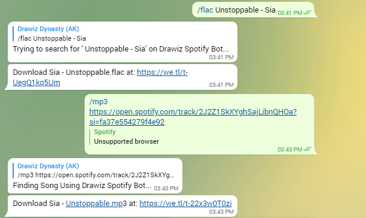

# Drawiz Spotify Bot #
## Telegram Bot that Download songs from Spotify using spotDL Binary ##

<p align="center">
<a href="https://heroku.com/deploy?template=https://github.com/DRAWIZ/Drawiz-FLAC-MP3">
  
</a>
</p>

### Demo Bot Picture ###



### Features ###

- Download FLAC / MP3 songs / playlist / album from Spotify.

### Heroku Depoly ###

- Open Bot.py Change bottoken at line 7

- Just Create an App

- Open Deploy And Connect with Github

- Search With github name and in Mannual Deploy 

- Check wheather the depoly Branch in Master and select depoly Branch
 
- Open Resource And Enable the worker python bot.py

- Enjoy With your Drawiz Spotify Downlloader Bot.

# Bot Commands
```
start - Check Wheather bot is alive
mp3 - Hold cmd and paste your spotify link or type song name for .mp3 format
flac - Hold cmd and paste your spotify link or type song name for .flac format
more - more bot and groups from Drawiz
help - All cmds with description
 
```


### Credits and thanks ###
- [spotDL](https://github.com/spotdl) for their work
- [pyTelegramBotAPI](https://github.com/eternnoir/pyTelegramBotAPI) for API used in this bot
- You
